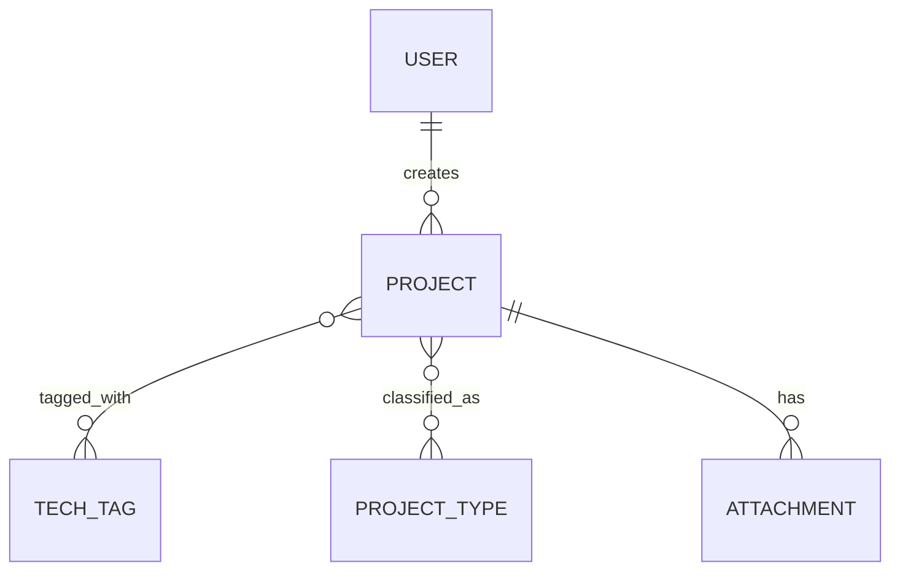

# Delta Spec — CHANGE-002-architecture

> Chi tiết lý do/phương án xem `proposal.md` cùng ticket này. File này chỉ
> ghi phần nội dung sẽ được gộp vào `specs/architecture.md` và
> `specs/data-model.md` khi merge — cả 2 file hiện chưa có nội dung thật
> (chỉ có placeholder mẫu), nên toàn bộ mục dưới đây đánh dấu **(MỚI)**.

- **Ticket ID**: CHANGE-002-architecture
- **Module bị ảnh hưởng**: `specs/architecture.md`, `specs/data-model.md`
- **Loại thay đổi**: ☑ Thêm mới &nbsp; ☐ Sửa &nbsp; ☐ Xoá

## 1. Yêu cầu thay đổi (EARS notation)

### `specs/architecture.md`

- **[ARCH-01] (MỚI)** The system shall serve the frontend as a static
  React SPA hosted on S3 and distributed via CloudFront.
- **[ARCH-02] (MỚI)** The system shall expose backend APIs through API
  Gateway (HTTP API), routing all requests to a single Lambda function
  running FastAPI via the Mangum adapter.
- **[ARCH-03] (MỚI)** The system shall store relational data in Aurora
  Serverless v2 (PostgreSQL), accessed by the Lambda function via RDS
  Data API.
- **[ARCH-04] (MỚI)** The system shall authenticate users via an AWS
  Cognito User Pool; API Gateway shall verify the JWT using a Cognito
  Authorizer before invoking the Lambda function.
- **[ARCH-05] (MỚI)** The system shall determine a user's role
  (`admin`/`member`) from the Cognito Group claim embedded in the JWT,
  and shall not duplicate this role in the application database.
- **[ARCH-06] (MỚI)** The system shall store project attachments in a
  dedicated S3 bucket, uploaded via presigned URL issued by the backend.
- **[ARCH-07] (MỚI)** The system's infrastructure shall be defined as
  code using AWS CDK (Python).
- **[ARCH-08] (MỚI)** The system shall provide exactly two environments
  — `local` (docker-compose PostgreSQL + `uvicorn` running FastAPI
  directly, no Lambda) and `production` (full AWS stack described
  above). No staging environment shall be provisioned.
- **[ARCH-09] (MỚI)** The system shall log every API request (request
  id, user id, method, path, status code, duration) to CloudWatch Logs
  for audit traceability.

### `specs/data-model.md`

**Sơ đồ ER tổng quan (chỉ tên bảng + quan hệ, xem chi tiết field ở
`specs/<module>.md` của module sở hữu — quy tắc "1 entity = 1 module sở
hữu"):**

| Entity      | Module sở hữu | Spec chi tiết (field-level)                |
|-------------|----------------|------------------------------------------------|
| User        | auth           | `specs/auth.md` (chưa có — ticket riêng)       |
| Project     | projects       | `specs/projects.md` (chưa có — ticket riêng)   |
| TechTag     | projects       | `specs/projects.md` (chưa có — ticket riêng)   |
| ProjectType | projects       | `specs/projects.md` (chưa có — ticket riêng)   |
| Attachment  | projects       | `specs/projects.md` (chưa có — ticket riêng)   |

**Quy ước chung toàn hệ thống (áp dụng mọi bảng):**

- **[DM-G01] (MỚI)** The system shall use an auto-incrementing integer
  (serial/bigint identity) as the primary key type for every table —
  KHÔNG dùng UUID (quyết định riêng cho quy mô nội bộ hiện tại; có thể
  đổi sang UUID sau này nếu phát sinh nhu cầu).
- **[DM-G02] (MỚI)** Every table shall include `created_at` (timestamp);
  tables whose rows can be updated shall additionally include
  `updated_at` (timestamp, auto-managed).
- **[DM-G03] (MỚI)** The system shall use hard-delete (xoá cứng bản ghi)
  cho v1 — chưa áp dụng soft-delete (`deleted_at`) cho bảng nào, vì chưa
  có yêu cầu giữ lại lịch sử bản ghi đã xoá.
- **[DM-G04] (MỚI)** Foreign key column naming convention:
  `<referenced_table>_id` (vd: `project_id`, `tag_id`), TRỪ trường hợp
  tên ngữ nghĩa rõ hơn được ưu tiên (vd: `created_by` thay vì `user_id`
  trên bảng `projects`).
- Migration tool: **Alembic** (không đánh số DM-G riêng vì là công cụ,
  không phải rule schema).

**Ràng buộc tuân thủ chung:**

- The system shall treat `customer_name` (tên khách hàng Nhật) as
  confidential business data — masked whenever data is exported outside
  the system, theo `specs/vision.md` mục 4.
- Audit log retention period: **chưa quyết định** — sẽ chốt khi làm
  `specs/cross-cutting/logging.md`.

## 2. Acceptance criteria / Test mapping

| ID       | Test case tương ứng (file/tên)                                    |
|----------|--------------------------------------------------------------------|
| ARCH-01  | `TC-ARCH-01: SPA load qua CloudFront URL trả về 200 + asset đúng`   |
| ARCH-02  | `TC-ARCH-02: Gọi API qua API Gateway → Lambda xử lý đúng route`     |
| ARCH-03  | `TC-ARCH-03: Lambda đọc/ghi dữ liệu qua RDS Data API thành công`    |
| ARCH-04  | `TC-ARCH-04: Request không có/sai JWT bị API Gateway trả 401`       |
| ARCH-05  | `TC-ARCH-05: User thuộc Cognito Group "admin" có full quyền`        |
| ARCH-06  | `TC-ARCH-06: Upload file qua presigned URL, xuất hiện trong S3`     |
| ARCH-07  | `TC-ARCH-07: cdk synth chạy không lỗi, cdk deploy tạo đủ resource`   |
| ARCH-08  | `TC-ARCH-08: docker-compose up chạy được toàn bộ stack ở local`     |
| ARCH-09  | `TC-ARCH-09: Log CloudWatch có đủ field request_id/user/status`     |
| DM-G01   | `TC-DM-01: Insert row mới, kiểm tra PK là int tự tăng`              |
| DM-G02   | `TC-DM-02: Update row, kiểm tra updated_at thay đổi`                |
| DM-G03   | `TC-DM-03: Xoá 1 project, kiểm tra record bị xoá cứng (không còn trong DB)` |
| DM-G04   | `TC-DM-04: Review tên cột FK khớp quy ước khi thêm bảng mới`        |

> Test case cụ thể (theo format Excel test case của dự án, `CLAUDE.md`
> mục 7) sẽ được viết đầy đủ khi có ticket implement thật — ở đây tên
> test case chỉ để đảm bảo mỗi acceptance criterion đều trace được sang
> 1 test case, chưa phải nội dung test chi tiết.

## 3. Ghi chú cho AI agent khi implement

- Ticket này **chỉ chốt spec/kiến trúc**, chưa implement — không có
  `plan.md`/`tasks.md` ở giai đoạn này (đã xác nhận với Product owner).
  Khi bắt đầu code thật, mở ticket implement riêng, dùng nội dung đã
  fold vào `specs/architecture.md` + `specs/data-model.md` làm nguồn
  tham chiếu, và chạy qua skill `writing-plans` để tạo
  `plan.md`/`tasks.md` lúc đó.
- Data model nghiệp vụ cụ thể (bảng `users`, `projects`, `tech_tags`...)
  KHÔNG nằm trong ticket này — sẽ có ticket riêng cho từng module
  (`auth`, `projects`), chỉ áp dụng quy ước nền tảng DM-G01..04 ở trên.
  Field-level schema của mỗi entity chỉ định nghĩa ở ĐÚNG 1 module sở
  hữu (xem bảng entity → module ở trên).
