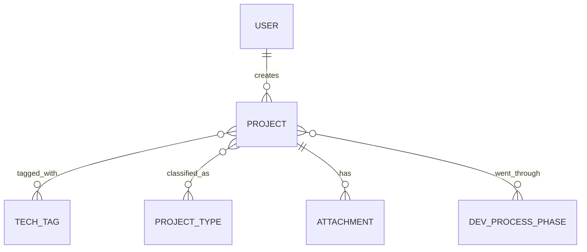

# Data Model — Tổng quan ER toàn hệ thống

> File này CHỈ giữ bức tranh tổng quan (bảng nào tồn tại, quan hệ với
> nhau ra sao) + quy ước chung — đúng nghĩa "nền tảng, ít đổi". KHÔNG chứa
> field/type/constraint chi tiết của từng bảng — phần đó nằm trong
> `specs/<module>.md` (mục `## Data Model`) của module SỞ HỮU entity đó
> (xem CLAUDE.md mục 4, quy tắc "1 entity = 1 module sở hữu").
>
> File này chỉ cập nhật khi có bảng MỚI xuất hiện hoặc bị xoá, hoặc quan
> hệ giữa các bảng thay đổi — KHÔNG cập nhật khi chỉ thêm/sửa field.
>
> Các entity dưới đây phản ánh thiết kế đã thống nhất khi brainstorm kiến
> trúc (`changes/_archive/CHANGE-002-architecture/`), nhưng **module sở
> hữu (`auth`, `projects`) chưa có `specs/<module>.md` chính thức** — sẽ
> được lập ở ticket riêng cho từng module.

## 1. Sơ đồ ER tổng quan (chỉ tên bảng + quan hệ, không có field)

## 2. Bảng entity → module sở hữu

> Mỗi entity chỉ có ĐÚNG 1 module sở hữu (nơi field-level schema được
> định nghĩa). Module khác nếu chỉ tham chiếu (FK) tới entity này thì
> KHÔNG lặp lại field, chỉ ghi "tham chiếu `<Entity>.id`, xem spec module
> sở hữu".

| Entity      | Module sở hữu | Spec chi tiết (field-level)                |
|-------------|----------------|------------------------------------------------|
| User        | auth           | `specs/auth.md` (chưa có — ticket riêng)       |
| Project     | projects       | `specs/projects.md` (chưa có — ticket riêng)   |
| TechTag     | projects       | `specs/projects.md` (chưa có — ticket riêng)   |
| ProjectType | projects       | `specs/projects.md` (chưa có — ticket riêng)   |
| Attachment  | projects       | `specs/projects.md` mục Data Model             |
| DevProcessPhase | projects   | `specs/projects.md` mục Data Model             |

> Bảng nối (`project_tech_tags`, `project_project_types`,
> `project_dev_process_phases`) là chi tiết triển khai của quan hệ N-N
> `Project ↔ TechTag` / `Project ↔ ProjectType` / `Project ↔
> DevProcessPhase` — không phải entity nghiệp vụ riêng nên không có
> dòng riêng ở trên; field-level của chúng vẫn định nghĩa trong
> `specs/projects.md`.

## 3. Quy ước chung toàn hệ thống (áp dụng mọi bảng)

- **[DM-G01]** The system shall use an auto-incrementing integer
  (serial/bigint identity) as the primary key type for every table —
  KHÔNG dùng UUID (quyết định riêng cho quy mô nội bộ hiện tại, xem
  `changes/_archive/CHANGE-002-architecture/proposal.md` mục 2.1; có thể
  đổi sang UUID sau này nếu phát sinh nhu cầu).
- **[DM-G02]** Every table shall include `created_at` (timestamp); tables
  whose rows can be updated shall additionally include `updated_at`
  (timestamp, auto-managed).
- **[DM-G03]** The system shall use hard-delete (xoá cứng bản ghi) cho
  v1 — chưa áp dụng soft-delete (`deleted_at`) cho bảng nào, vì chưa có
  yêu cầu giữ lại lịch sử bản ghi đã xoá.
- **[DM-G04]** Foreign key column naming convention: `<referenced_table>_id`
  (vd: `project_id`, `tag_id`), TRỪ trường hợp tên ngữ nghĩa rõ hơn được
  ưu tiên (vd: `created_by` thay vì `user_id` trên bảng `projects`, vì
  ngữ nghĩa "người tạo" rõ ràng hơn).
- Migration tool: **Alembic** (không đánh số DM-G vì là công cụ, không
  phải rule schema).

## 4. Ràng buộc tuân thủ chung (nếu áp dụng — vd APPI)

- The system shall treat `customer_name` (tên khách hàng Nhật) as
  confidential business data — masked whenever data is exported outside
  the system, theo `specs/vision.md` mục 4.
- Audit log retention period: **chưa quyết định** — sẽ chốt khi làm
  `specs/cross-cutting/logging.md`.

## 5. Lịch sử thay đổi (chỉ log khi THÊM/XOÁ bảng hoặc đổi quan hệ)

| Ngày       | Ticket ID              | Thay đổi                                                        |
|------------|--------------------------|----------------------------------------------------------------------|
| 2026-08-14 | CHANGE-002-architecture | Khởi tạo: thêm User, Project, TechTag, ProjectType, Attachment + quy ước chung |
| 2026-08-19 | CHANGE-012-project-extra-fields | Thêm bảng mới DevProcessPhase, quan hệ `Project }o--o{ DevProcessPhase` |

<!-- Thêm field vào User/Project... KHÔNG log ở đây — xem lịch sử trong
     specs/<module>.md tương ứng. -->
